The R Programming Language
========================================================
author: Barry Snowe
date: December 13th, 2016
autosize: true

R in a nutshell
========================================================
R is an open source implementation of the S and S-Plus statistical programming languages. R is free to download and use, as is the R Studio IDE.


Visualizations
====================================
The base R language has several functions for plotting. In addition, there
are a few very useful libraries for data visualization. We will use **ggplot2**,
which was created by Hadley Wickham using the concept of the "grammar of graphics," a concept first articulated by statistician Leland Wilkinson.

The data set: mtcars
===============================
Many of the visualizations that follow center around the **mtcars** data set. **mtcars** is part of the data sets that come with base R. It is very frequently referred to in R tutorials. The help file describes it like this:  
> The data was extracted from the 1974 Motor Trend US magazine, and comprises fuel consumption and 10 aspects of automobile design and performance for 32 automobiles (1973–74 models).  
  
  
Partial data set
=======================
The first five rows of the data set are presented below.


```
                   mpg cyl disp  hp drat    wt  qsec vs am gear carb
Mazda RX4         21.0   6  160 110 3.90 2.620 16.46  0  1    4    4
Mazda RX4 Wag     21.0   6  160 110 3.90 2.875 17.02  0  1    4    4
Datsun 710        22.8   4  108  93 3.85 2.320 18.61  1  1    4    1
Hornet 4 Drive    21.4   6  258 110 3.08 3.215 19.44  1  0    3    1
Hornet Sportabout 18.7   8  360 175 3.15 3.440 17.02  0  0    3    2
```

Research question
========================================
We are interested in the variable **mpg** (miles per gallon).  

Particularly, we want to know which of the other variables in our data set might be influential in determining (or predicting) miles per gallon. In a realistic research scenario, we would use multiple regression analysis. Here we will restrain ourselves to making some simple comparisons of **mpg** with the other variables in the data set, one at a time.  

The goal is to see if there are any strong patterns that emerge that might guide us in asking more sophisticated questions.


mtcars1: pairs plot
========================================================
Using the pairs() command we can generate a correlation matrix. We can get a bird's eye view of the scatter plots of every variable against each other.  

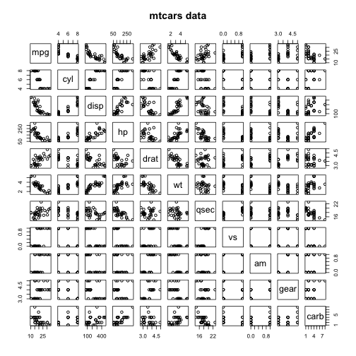

Box plots of MPG versus data set factor variables
====================================================
The following 5 slides examine how the distribution of miles per 
gallon is influenced by the *factor* variables in the data set. The factor
variables are:  
* Number of cylinders
* Transmission type (auto vs. manual)
* Engine type
* Number of gears
* Number of carburetors

mtcars2: MPG by cylinder (mpg~cyl)
========================================================
Right away, we can see that the base R plots lack a certain aesthetic quality.

```r
boxplot(mpg ~ cyl, mtcars, xlab = "Cylinders",
        ylab = "MPG",
        col = c("red", "blue", "green"),
        main = "MPG by Cylinders")
```

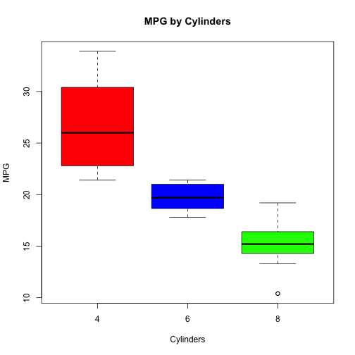

mtcars3: MPG by transmission type (mpg~am)
================================================
Soon we will examine plotting functions that let us create much more appealing graphs than these.

```r
boxplot(mpg ~ am, mtcars, xlab = "Transmission Type",
        ylab = "MPG",
        col = c("red", "blue"),
        main = "MPG by Transmission Type")
```

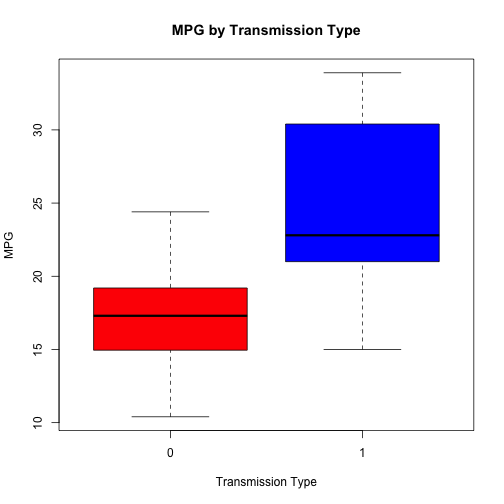

mtcars4: MPG by engine type (mpg~vs)
==============================================

```r
boxplot(mpg ~ vs, mtcars, xlab = "Engine Type",
        ylab = "MPG",
        col = c("red", "blue"),
        main = "MPG by Engine Type")
```

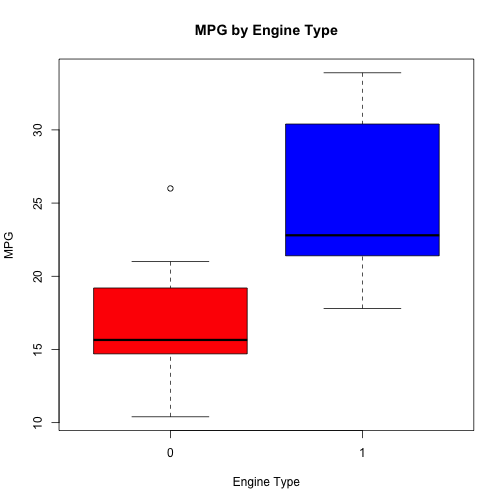


mtcars5: MPG by number of gears (mpg~gear)
===============================================

```r
boxplot(mpg ~ gear, mtcars, xlab = "Number of Forward Gears",
        ylab = "MPG",
        col = c("red", "blue", "green"),
        main = "MPG by Number of Forward Gears")
```

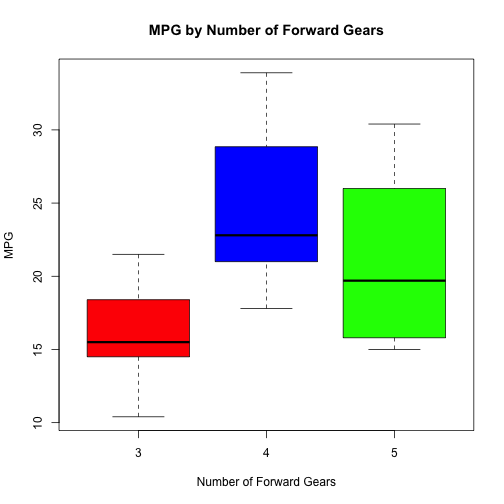

mtcars6: MPG by number of carburetors (mpg~carb)
=====================================

```r
boxplot(mpg ~ carb, mtcars, xlab = "Number of Carburetors",
        ylab = "MPG",
        col = c("red", "blue", "green", "yellow", "orange", "purple"),
        main = "MPG by Number of Carburetors")
```

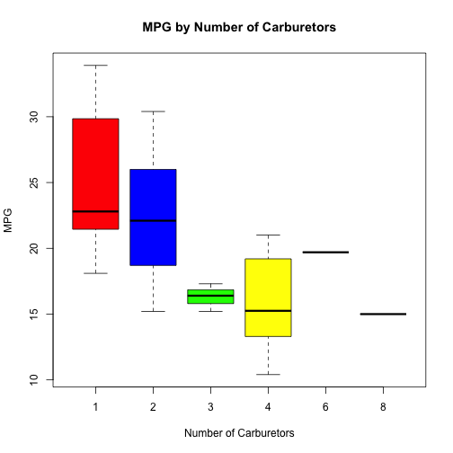


Scatter plots of MPG versus data set continuous variables
============================================================
The next 5 slides are scatter plots of **mpg** against the continuous variables in the data set, treated as explanatory variables. These plots allow us to think in terms of lines of least squares, and to visually inspect the data for any weird outliers or obvious patterns that would influence the outcome of a linear regression.  

The other five continuous variables in the data set are:  
* Displacement (in cubic inches)
* Horsepower
* Rear axle ration
* Weight
* Quarter mile time

mtcars7: MPG by displacement (mpg~disp)
=======================================

```r
plot(mpg ~ disp, mtcars,
     xlab = "Displacement (cubic inches)",
     ylab = "MPG",
     col = "red",
     pch = 19,
     main = "MPG by Displacement")
```

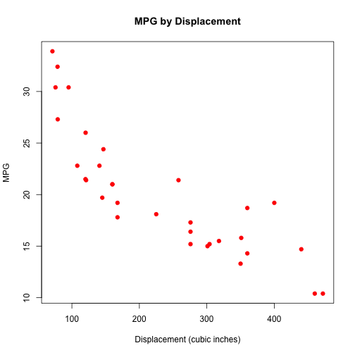

mtcars8: MPG by horsepower (mpg~hp)
==============================

```r
plot(mpg ~ hp, mtcars,
     xlab = "Gross Horsepower",
     ylab = "MPG",
     col = "red",
     pch = 19,
     main = "MPG by Gross Horsepower")
```

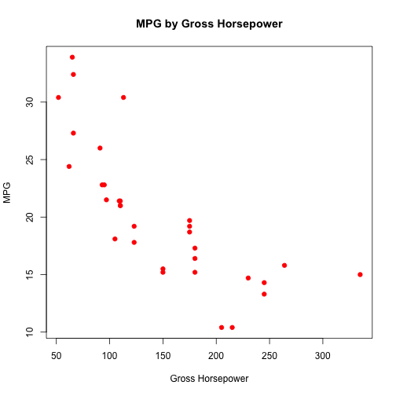

mtcars9: MPG by rear axle ratio (mpg~drat)
=====================================

```r
plot(mpg ~ drat, mtcars,
     xlab = "Rear Axle Ratio",
     ylab = "MPG",
     col = "red",
     pch = 19,
     main = "MPG by Rear Axle Ratio")
```

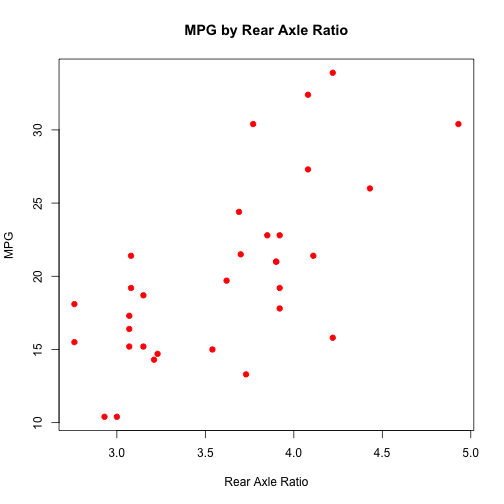

mtcars10: MPG by weight (mpg~wt)
==========================

```r
plot(mpg ~ wt, mtcars,
     xlab = "Weight (1000 lbs)",
     ylab = "MPG",
     col = "red",
     pch = 19,
     main = "MPG by Weight")
```

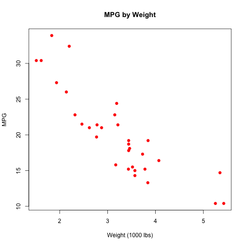


mtcars11: MPG by quarter mile time (mpg~qsec)
======================================

```r
plot(mpg ~ qsec, mtcars,
     xlab = "Quarter-Mile Time",
     ylab = "MPG",
     col = "red",
     pch = 19,
     main = "MPG by Quarter-Mile Time")
```

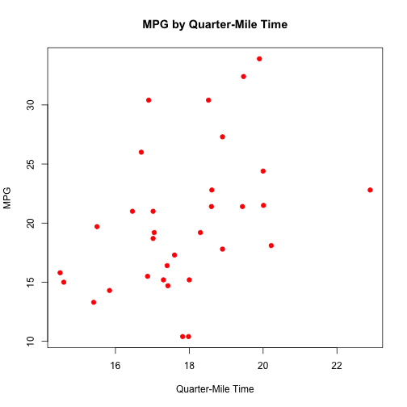


The ggplot2 library
==============================
The rest of the slides will rely heavily on the **ggplot2** library for their data visualizaitons.  We will start by using the quick plotting command **qplot()** to continue our look at the **mtcars** data set. Afterwards, we will look at a variety of data with the more customizable **ggplot()** command.

We can call the library like this:

```r
library(ggplot2)
```

Other questions for EDA
================================
We can ask a lot of questions about the data before formalizing our hypothesis and conducting more rigourous statistics. With our **mtcars** data we have been asking about the differing breakdowns of **mpg** over various subsets. We could also ask about the distributions of the other variables. By simply plotting one single-variable distribution after another, we could check to see which, if any, potential explanatory variables have skewed distributions or bimodal plots. We can look for outliers as well as missing values. In larger, more complicated data sets, we could use *feature detection* algorithms or other ideas from the field of machine learning.

The focus: vehicle weight
================================
Let's say we're interested in the **wt** (weight) variable, as it appears to be influential upon **mpg**. We're going to focus on the relationship between those two variables, especially as it is itself influenced by the presence of other variables.  

Again, in practice we would want to use multiple regression as a supplement to, or outright replacement for, this approach. For the time being, this will give us a chance to see the **qplot()** function in action.  

qplot1: mpg~wt
=============================
This is your standard issue "Hello World" **qplot()** graph right here.

```r
qplot(wt, mpg, data=mtcars)
```

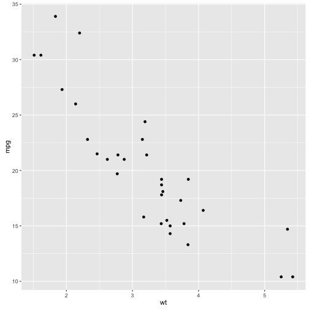

qplot2: mpg~wt, by cyl (using color)
=============================
Here we use color to identify a third variable (number of cylinders).

```r
qplot(wt, mpg, data=mtcars, color=cyl)
```

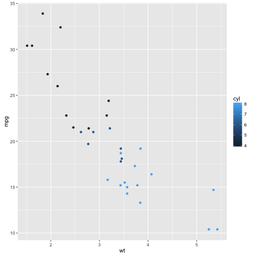

qplot3: mpg~wt, by cyl (using point size)
============================================
Now we are using the size of the data points to identify the same third variable. Which approach might be preferable to the other depends on the data and the type/size of display used.

```r
qplot(wt, mpg, data=mtcars, size=cyl)
```

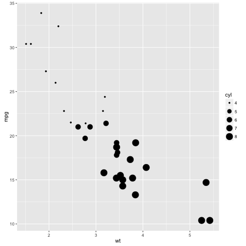

qplot4: two added variables (using facets)
=============================================
This could benefit from better labeling; I'm not sure which part refers to **vs** and which refers to **am**.

```r
qplot(wt, mpg, data=mtcars, facets= vs~am)
```

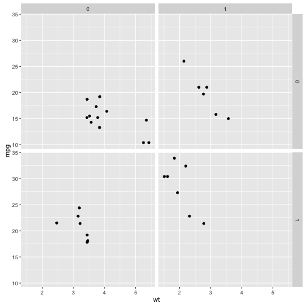

qplot5: A residual plot
===========================================
This is the kind of output we would expect in the first trial run of a regression analysis. We're looking at one plot of residuals - generally there are about four such standard plots you want to look at to check initial assumptions about variance. The base R **plot()** command will generate these for you when used on a linear model.

```r
mod <- lm(mpg~wt, data=mtcars)
qplot(resid(mod), fitted(mod))
```

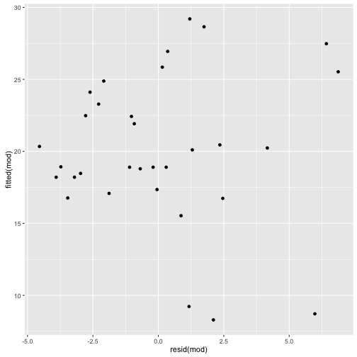

qplot6: General purpose color selection
===============================================
Look! Red dots!

```r
qplot(wt, mpg, data=mtcars, color=I("red"))
```

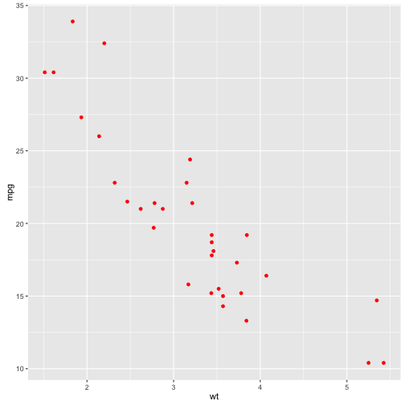

qplot7: only x supplied = histogram
==========================================
By only supplying one value to **qplot()**, we get a histogram in return.

```r
qplot(mpg, data=mtcars)
```

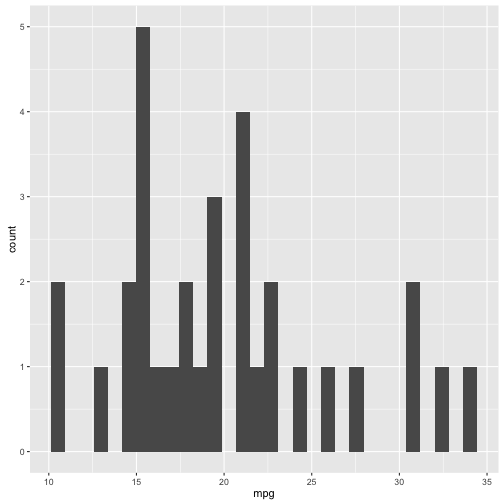


qplot8: only y = scatterplot, with x = seq_along(y)
=============================================
In this case, we specify a y variable and the x variable is assumed to be a number indicating the row number of the data point. It's a trivial usage of this technique, but in the instance of, say, a time series this could be meaningfully applied.

```r
qplot(y = mpg, data=mtcars)
```

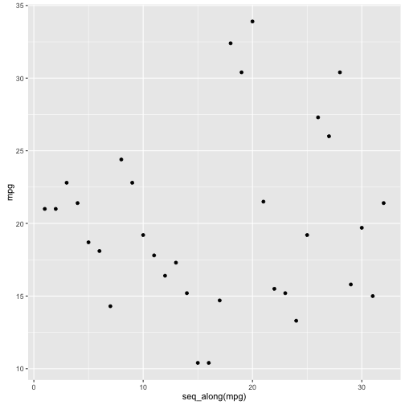

qplot9: jitter-point box plots
=================================================
We can add a layer of detail to a graph of boxplots. In this case, the extra information we get is the exposure of the severe outliers in the 8-cylinder engine category.

```r
qplot(factor(cyl), wt, data=mtcars, geom=c("boxplot", "jitter"))
```

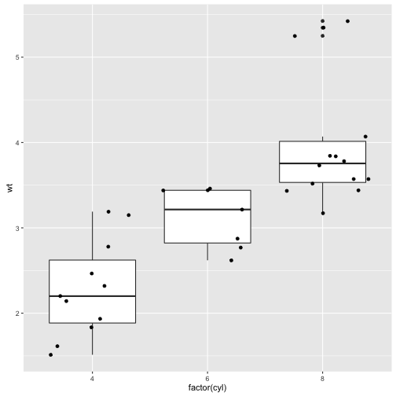

qplot10: a dot plot
==================================================
This has basically the same information value as a histogram, except it's technically a "bar graph of counts." Using a dot plot has the added benefit of making the discrete nature of the counts transparent, as well as underscoring the lack of smooth continuity of the recorded values of **mpg**.

```r
qplot(mpg, data=mtcars, geom="dotplot")
```

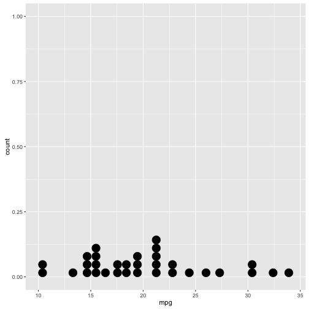


Using the ggplot() command
=======================================
The next slides will show a variety of uses for the **ggplot()** command. The code and the resulting graphs are taken from the excellent book **The R Graphics Cookbook**, by Winston Chang. The figure numbers correspond to the figures in this text.  

In addition to the **ggplot2** library, we will need the **gcookbook** library that accompanies the Chang text. We will also need the **plyr** library very briefly.

```r
library(gcookbook)
library(plyr)
```

Bar graphs
============================
**ggplot2** uses "geoms" to support the **ggplot()** function. Geoms add functionality to the graphs, allowing them to understand how we want to display the data. We will add **geom_bar()** to our **ggplot()** function calls for the next few slides. 

fig 3-1 - basic bar graph
==================================
When I see this graph, I can't think of anything but the Black Flag logo.

```r
ggplot(pg_mean, aes(x=group, y=weight)) +
  geom_bar(stat="identity")
```

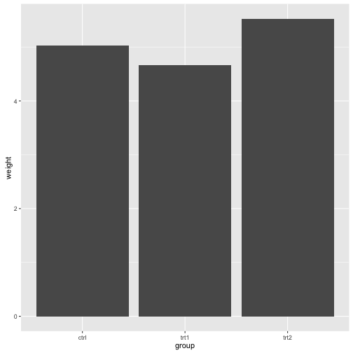

fig 3-3 - bar graph with color
==================================

```r
ggplot(pg_mean, aes(x=group, y=weight)) +
  geom_bar(stat="identity", fill="lightblue",
           color="black")
```

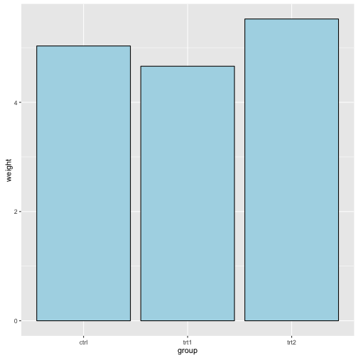

fig 3-4 - grouping bars together
==================================
We're using color to discern between the values of a factor. It has something to do with cabbage.

```r
ggplot(cabbage_exp, aes(x=Date, y=Weight, fill=Cultivar)) +
  geom_bar(position="dodge", stat="identity")
```

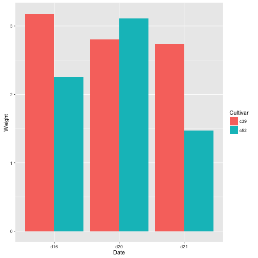

fig 3-7 - a bar graph of counts
==================================
This refers to the **diamonds** data set.

```r
# use geom_bar, but without mapping anything to y
ggplot(diamonds, aes(x=cut)) +
  geom_bar()
```

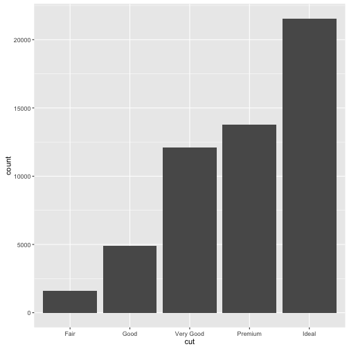

fig 3-8 - a histogram
==================================
Using the **diamonds** data set again, we look at the distribution of the **carat** variable.

```r
# aka a bar graph of counts on a continuous axis
ggplot(diamonds, aes(x=carat)) +
  geom_histogram()
```

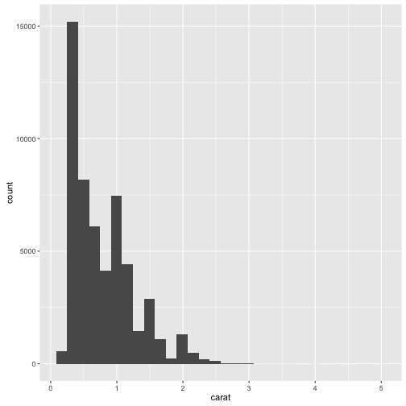

fig 3-9 - bar graph using colors
==================================
Using a subset of a data set of US state population change, we use individual bars for states, and color to group the states into regions.

```r
upc <- subset(uspopchange, rank(Change) > 40)
ggplot(upc, aes(x=Abb, y=Change, fill=Region)) +
  geom_bar(stat="identity")
```

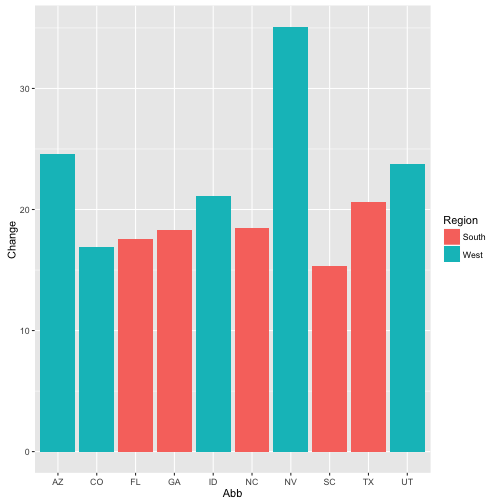

fig 3-11 - bar graph with colors for sign values
==================================
We can assign colors to positive and negative numeric values.

```r
csub <- subset(climate, Source=="Berkeley" & Year >= 1900)
csub$pos <- csub$Anomaly10y >= 0
ggplot(csub, aes(x=Year, y=Anomaly10y, fill=pos)) +
  geom_bar(stat="identity", position="identity")
```

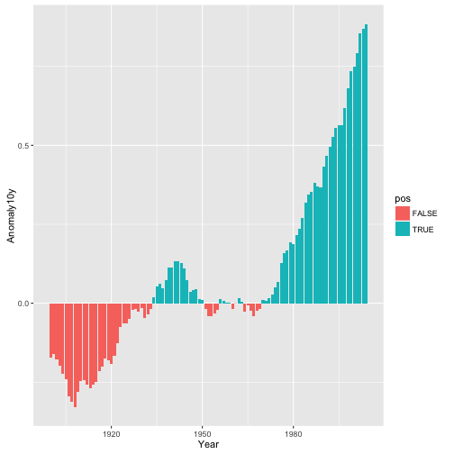

fig 3-17 - stacked bar graph
==================================
More cabbage data.

```r
ggplot(cabbage_exp, aes(x=Date, y=Weight, fill=Cultivar)) +
  geom_bar(stat="identity") +
  guides(fill=guide_legend(reverse=TRUE))
```

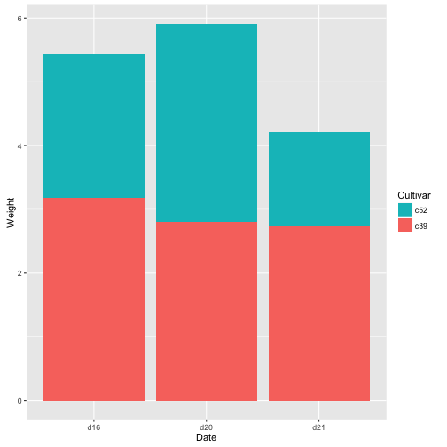

fig 3-31 - dot plot with facets and color
==================================
This graph takes a subset of 2001's best 25 hitters in baseball, sorts them by league, and then reorders the data before presenting it as a faceted dot plot.

```r
tophit <- tophitters2001[1:25, ] # top 25 hitters
nameorder <- tophit$name[order(tophit$lg, tophit$avg)]
tophit$name <- factor(tophit$name, levels=nameorder)
ggplot(tophit, aes(x=avg, y=name)) +
  geom_segment(aes(yend=name), xend=0, color="grey50") +
  geom_point(size=3, aes(color=lg)) +
  scale_color_brewer(palette="Set1", limits=c("NL", "AL"), guide=FALSE) +
  theme_bw() +
  theme(panel.grid.major.y = element_blank()) +
  facet_grid(lg ~ ., scales="free_y", space="free_y")
```

The resulting dot plot
=============================
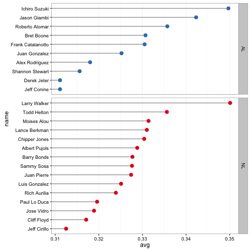

Line graphs
=======================================
Next we will see how **ggplot2** handles line graphs. We add **geom_line()** and **geom_point()** at various spots.


fig 4-5 line graph with points
=======================================
Your basic world population hockey stick graph.

```r
ggplot(worldpop, aes(x=Year, y=Population)) +
  geom_line() +
  geom_point()
```

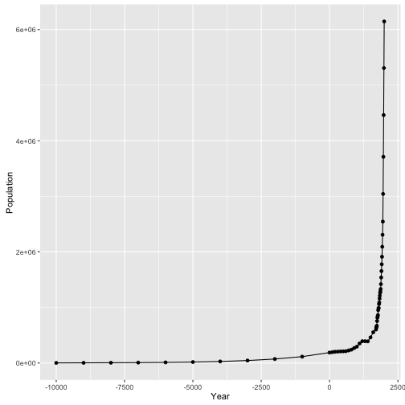

fig 4-13b - line graph with points and color
=======================================

```r
tg <- ddply(ToothGrowth, c("supp", "dose"), summarize, length=mean(len))
ggplot(tg, aes(x=dose, y=length, color=supp)) +
  geom_line(linetype="dashed") +
  geom_point(shape=22, size=3, fill="white")
```

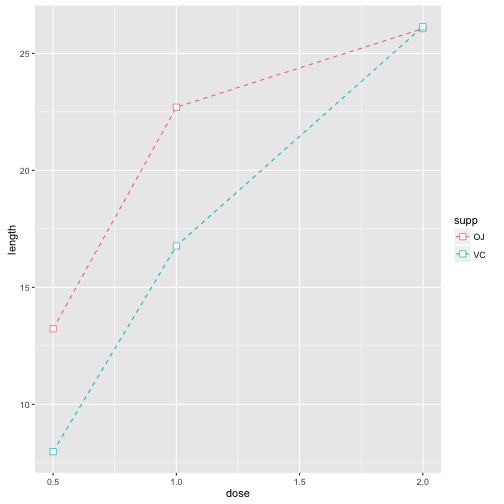

fig 4-19 - shaded area graph
=======================================

```r
sunspotyear <- data.frame (
  Year = as.numeric(time(sunspot.year)),
  Sunspots = as.numeric(sunspot.year)
)

ggplot(sunspotyear, aes(x=Year, y=Sunspots)) +
  geom_area(fill="blue", alpha=0.2) +
  geom_line()
```


The resulting graph
=======================================
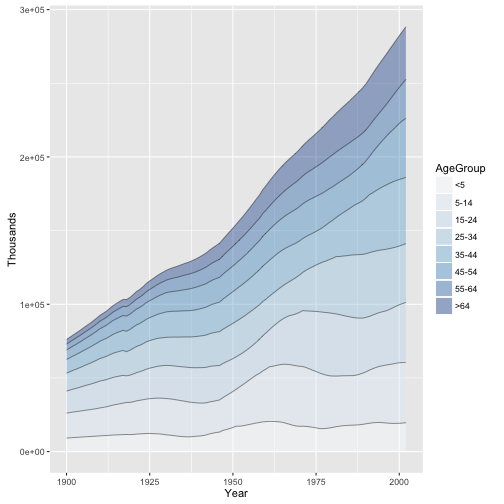

fig 4-20 - stacked area graph with full colors
=======================================
Viewing layers of population composition through mind-blowing color display.

```r
ggplot(uspopage, aes(x=Year, y=Thousands, fill=AgeGroup)) +
  geom_area()
```

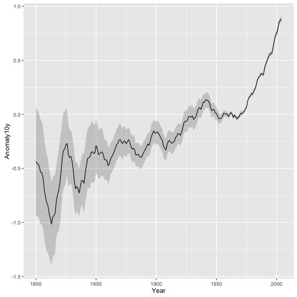

fig 4-23 - stacked area graph with subtler color, reversed stacking order
=======================================

```r
ggplot(uspopage, aes(x=Year, y=Thousands, fill=AgeGroup,
                     order=desc(AgeGroup))) +
  geom_area(color=NA, alpha=.4) + 
  scale_fill_brewer(palette="Blues") +
  geom_line(position="stack", size=.2)
```


fig 4-25 - line graph with confidence region
=======================================
There are lots of "smoothing" functions available to emphasize confidence bands, prediction bands, and any other enhancements you wish to provide to a line graph.

```r
clim <- subset(climate, Source=="Berkeley",
               select=c("Year", "Anomaly10y", "Unc10y"))

ggplot(clim, aes(x=Year, y=Anomaly10y)) +
  geom_ribbon(aes(ymin=Anomaly10y-Unc10y,
                  ymax=Anomaly10y+Unc10y),
              alpha=0.2) +
  geom_line()
```


  
Scatter plots
===========================================
Next, we'll see how **ggplot2** handles scatter plots.


fig 5-1 - Basic scatter plot
===========================================

```r
ggplot(heightweight, aes(x=ageYear, y=heightIn)) +
  geom_point()
```

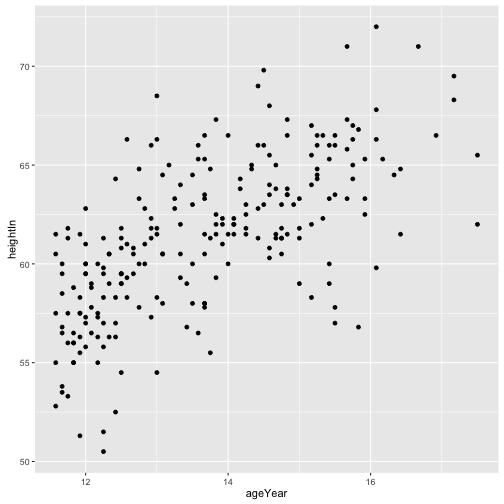

fig 5-4a - Scatter plot with third (factor) variable
===========================================

```r
ggplot(heightweight, aes(x=ageYear, y=heightIn, color=sex)) +
  geom_point()
```

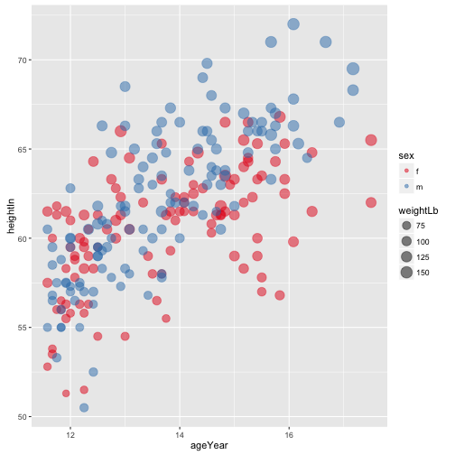

fig 5-9a - Scatter plot with third (continuous) variable
===========================================

```r
ggplot(heightweight, aes(x=ageYear, y=heightIn, color=weightLb)) +
  geom_point()
```

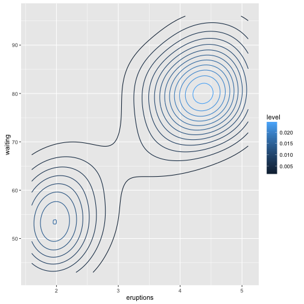

fig 5-11 - Scatter plot with two extra variables
===========================================

```r
# (one factor, the other continuous), revised colors
ggplot(heightweight, aes(x=ageYear, y=heightIn,
                         size=weightLb, color=sex)) +
  geom_point(alpha=0.5) +
  scale_size_area() + # make area proportional to numeric value
  scale_color_brewer(palette="Set1")
```


fig 6-33b - Density plot mapped to color
===========================================

```r
p <- ggplot(faithful, aes(x=eruptions, y=waiting))
p + stat_density2d(aes(color=..level..))
```


fig 6-34b - Density plot with points and density mapped to alpha
===========================================

```r
p + geom_point() +
  stat_density2d(aes(alpha=..density..), 
                 geom="tile", 
                 contour=FALSE)
```

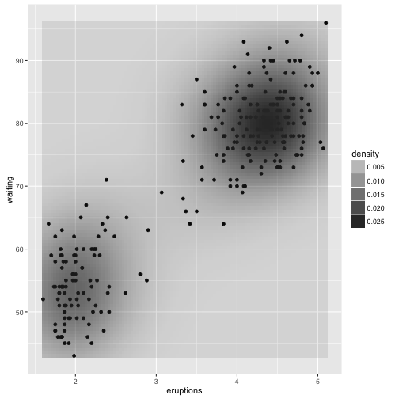


A simple project
==============

Get the data
=====================
Here, I set up the function to trim the extra ID column and add 
a season column. I will use this function on each file as I read
the file into the workspace.

```r
edit_tables <- function(df, year) {
  df <- df[, 2:28]
  season <- rep(toString(year), nrow(df))
  df <- cbind(season, df)
}
```

Edit data frame
======================
Now I can use that function to edit each data frame right when it is created.

```r
b2012 <- read.csv('blazers2012.csv')
b2012 <- edit_tables(b2012, 2012)

b2013 <- read.csv('blazers2013.csv')
b2013 <- edit_tables(b2013, 2013)

b2014 <- read.csv('blazers2014.csv')
b2014 <- edit_tables(b2014, 2014)

b2015 <- read.csv('blazers2015.csv')
b2015 <- edit_tables(b2015, 2015)

b2016 <- read.csv('blazers2016.csv')
b2016 <- edit_tables(b2016, 2016)
```


Create the main data frame
===========================

```r
# Now I need all that data in one "object."
# I can make one data frame out of many by using
# R's "rbind" (or row-bind) function.
blz <- rbind (b2012, b2013, b2014, b2015, b2016)
```

State of the data frame
=======================
Now our project has a data frame called "blz". That will be
the main item of interest. We could delete the other data frames
to preserve memory, but these aren't very large files and it doesn't
make sense to worry about them right now.

The current blz data frame doesn't have very descriptive 
column names. In some case they are long and unwieldy for
the purposes of display in a data frame.

Revise column names
=====================
Here I define some shorter names. Some aren't very descriptive,
but for the purpose of translating NBA season averages they 
should make sense.

```r
my_cols <- c('seas', 'pname', 'age',
             'games', 'start', 'mins',
             'fg', 'fga', 'fgp',
             't3p', 't3pa', 't3pp',
             't2p', 't2pa', 't2pp', 'efgp',
             'ft', 'fta', 'ftp',
             'orb', 'drb', 'trb',
             'ast', 'stl', 'blk',
             'tov', 'pf', 'pts')
```

Assign column names
====================
Here I assign those column names to the blz data frame.

```r
colnames(blz) <- my_cols
```

And the data frame is ready.


Subset the data
======================
I want to create a data frame of players who played more than one season
in the time frame under consideration.

Here's the basic functionality. Running this will PRINT the
different subsets, but it does not STORE them anywhere. This
is here for demonstration purposes so we can se what we're 
getting.


```
Error in eval(expr, envir, enclos) : object 'player' not found
```
